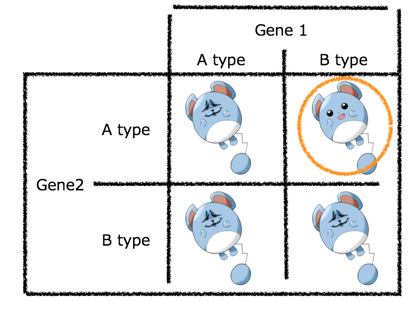

<!-- README.md is generated from README.Rmd. Please edit that file -->

```{r, include = FALSE}
knitr::opts_chunk$set(
  collapse = TRUE,
  comment = "#>",
  fig.path = "man/figures/README-",
  out.width = "100%"
)
```
# RILStEp 

<!-- badges: start -->
<!-- badges: end -->
RILStEp(Recombinant Inbred Lines Stepwise Epistasis analysis) package is the epistasis analysis tool.
This package enables to detect the epistatic relationships between SNPs for RIL population by comparison of 2 models based on bayes factor.<br>
publication: [https://doi.org/10.1093/g3journal/jkab130](https://doi.org/10.1093/g3journal/jkab130)

## Requirements

Other than CRAN package, `GWASpoly` package is required for RILStEp package.<br>
please download zip files from [here](https://potatobreeding.cals.wisc.edu/software/) <br>
and install `install.packages("GWASpoly_download/GWASpoly_1.3.tar.gz", repos = NULL, type = "source")`<br>
or `install.packages("GWASpoly_download/GWASpoly_1.3.zip", repos = NULL, type = "source")`

## Installation

You can install RILStEp from [GitHub](https://github.com/slt666666/RILStEp) with:

``` r
# install.packages("devtools")
devtools::install_github("slt666666/RILStEp")
```
## Example

This is a basic example script:

```{r example, eval = FALSE}
library(RILStEp)

### loading dataset
loaded_data <- load_data("phenotype.csv", "genotype.csv", "trait1")

### check all combinations of 2 SNPs
result1 <- rilstep(loaded_data, "result1", core_num = 8)

### using 1 SNP in each 500 SNPs
result2 <- rilstep(loaded_data, "result2", interval = 500)

### specify QTL-like SNPs by user.
result3 <- rilstep(loaded_data, "result3", qtls = c("chr08_19928351", "chr09_3909046"))

### using SNPs in specific regions
result4 <- rilstep(loaded_data, "result4", region = c("chr03_2132221:chr10_9330401", "chr03_2132221:chr10_9330401"))

### consider heterozygous
result5 <- rilstep(loaded_data, "result5", heterozygous = TRUE)

### example
result6 <- rilstep(loaded_data, "result6", interval = 500, region = c("chr03_2132221:chr10_9330401", "chr03_2132221:chr10_9330401"), core_num = 8)
```
option `region=c()` can specify regions. rilstep check all combinations of SNPs in specified regions.
```
region = c("chr03_1234")                                    # chr03_1234 x all SNPs
region = c("chr03_1234:chr10_5678")                         # chr03_1234 ~ chr10_5678 x all SNPs
region = c("chr03_1234", "chr10_5678")                      # chr03_1234 x chr10_5678
region = c("chr03_1234:chr10_5678", "chr04_9012:chr7_3456") # chr03_1234~chr10_5678 x chr04_9012~chr7_3456
```

## Input data format
input files should be csv format.<br>

phenotype data

| Name | trait1 |
----|----
| Sample1 | 12.3 |
| Sample2 | 23.4 |
| ... | ... |
| SampleXX | 78.9 |

genotype data

| Marker | Chrom | Position | Sample1 | Sample2 | ... | SampleXX |
----|----|----|----|----|----|----
| 1 | chr01 | 1234 | 2 | 2 | ... | 2 |
| 2 | chr01 | 3456 | 2 | 0 | ... | 0 |
| 3 | chr01 | 9999 | 0 | 0 | ... | 1 |
| ... | ... | ... | ... | ... | ... |
| XXX | chr12 | 4869786 | 0 | 0 | ... | 2 |

marker coded as {0,1,2} = {AA,AB,BB}<br>
A, B: each parental genotype<br>
!! Only bi-allelic markers are allowed !!
